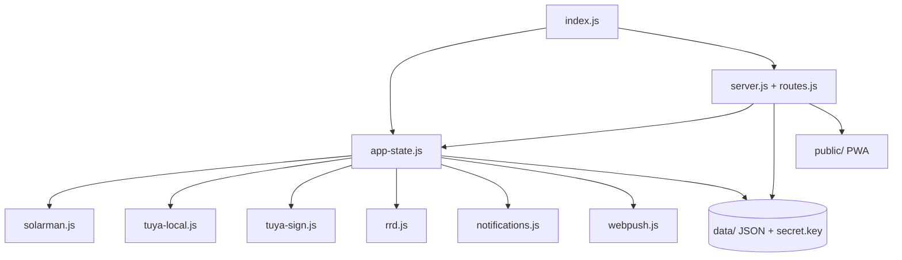

> For minimal context usage, read `/DOC_INDEX.md` first, then load only the documents needed for your task.

# CLAUDE.md
# Engineering navigation map. All detail lives in sub-documents.
# DOC_INDEX.md is the compressed routing layer above this file.

---

## 1. System Identity

**Project:** Strum
**One-liner:** Autonomous energy controller for a Raspberry Pi that monitors a Solarman V5 hybrid
inverter over Modbus TCP, controls Tuya smart plugs locally or via the Tuya Cloud, runs a scene
(condition→action) automation engine, and serves a dark-mode PWA with encrypted Web Push —
all with zero npm dependencies.

Strum solves home energy autonomy: during a grid outage it keeps the house powered by managing the
inverter (survival/island mode) and shedding/prioritizing loads through smart plugs per user-defined
scenes, while reporting live state, history (RRD 1m/15m/1h), costs, and notifications to a PWA.
The repo owns the entire single-process Node.js 22 server (`index.js` + `lib/`), the protocol
implementations (Solarman V5, Tuya 3.5/6699, RFC 8291 Web Push), and the PWA frontend (`public/`).
Deployment target is one Raspberry Pi behind systemd (`energy-controller`).

---

## 2. Repository Boundaries

**This repo owns:**
- Inverter telemetry: polling, register parsing, fault/alarm words, offline detection (`lib/solarman.js`).
- Tuya device management: local protocol 3.5/6699 (AES-128-GCM), cloud API, discovery, control modes.
- Scene automation engine: conditions, actions, cooldowns, manual runs, traces.
- Auth, sessions, CSRF, rate limiting, encrypted secret storage, TLS bootstrap.
- Notifications (in-app + ntfy + Telegram) and RFC 8291 encrypted Web Push with app badge.
- History persistence (RRD ring buffers) and the PWA frontend.

**This repo does NOT own:**
- Tuya cloud services (`openapi.tuyaeu.com`) and the Tuya device firmware — controlled by Tuya.
- The Solarman inverter firmware and its register semantics — vendor-defined.
- ntfy, Telegram, Web Push endpoints (FCM/APNs/Mozilla) — third-party delivery services.
- NetBird VPN — external `sudo netbird` CLI is invoked; the `.netbird.services` domain is theirs.

*AI assistants make poor decisions when repo ownership is unclear.*

---

## 3. Architecture

**Style:** Modular monolith (single process, one entry point wiring many decoupled `lib/` modules).

→ Full architecture: `/docs/architecture/SYSTEM_OVERVIEW.md`

---

## 4. Entry Points

| Entry Point | Path | Purpose |
|------------|------|---------|
| Process entry | `/index.js` | Config load, subsystem wiring, poll/save intervals, graceful shutdown |
| HTTP/API layer | `/lib/server.js` + `/lib/routes.js` | TLS bootstrap, auth+CSRF middleware, all `/api/*` handlers |
| Core state & scenes | `/lib/app-state.js` | Inverter poll loop, Tuya device manager, scene engine, cost/island logic |
| Inverter protocol | `/lib/solarman.js` + `/lib/crc16.js` | Modbus TCP over V5 frames, register map |
| Tuya local control | `/lib/tuya-local.js` | Protocol 3.5/6699, handshake, CONTROL_NEW, push, persistent socket |
| PWA frontend | `/public/index.html` | SPA UI (dark theme, charts, control panels, scene editor) |

→ Runtime startup and flow detail: `/docs/architecture/RUNTIME_FLOWS.md`

---

## 5. Core Runtime Flows

| Flow | Summary | Detail |
|------|---------|--------|
| Startup | Load config → ensure secret.key/certs → build subsystems → start HTTP + polling | `/docs/architecture/RUNTIME_FLOWS.md#1-process-startup` |
| Tuya connection | Persistent socket, 4-step handshake, 5s heartbeat, push frames keep cache fresh | `/docs/architecture/RUNTIME_FLOWS.md#2-persistent-tuya-local-connection` |
| Inverter poll | 10s timer → solarman query → parsed snapshot → change detection → scenes/notify | `/docs/architecture/RUNTIME_FLOWS.md#4-inverter-poll-flow` |
| Device control | UI → controlDevice → local (batched CONTROL_NEW, 3 retries) or cloud fallback | `/docs/architecture/RUNTIME_FLOWS.md#5-control-flow-tuya-device` |
| Scene check | 30s timer → evaluate conditions → run actions → cooldown/last-run recorded | `/docs/architecture/RUNTIME_FLOWS.md#6-scene-check-flow` |
| Login/auth | scrypt verify → session cookie `ecm_session` + CSRF → enforced on /api mutations | `/docs/architecture/RUNTIME_FLOWS.md#7-login--auth-flow` |
| Notification | in-app center + ntfy/Telegram → webpush.broadcast (2s debounce, RFC 8291) → SW badge | `/docs/architecture/RUNTIME_FLOWS.md#8-notification--web-push-flow` |

→ All execution traces: `/docs/architecture/RUNTIME_FLOWS.md`

---

## 6. High-Risk Areas

| Area | Risk | Why | Detail |
|------|------|-----|--------|
| `lib/app-state.js` | High | Central hub: poll loop, device manager, scene engine; most API handlers and scenes depend on it | `/docs/architecture/DEPENDENCY_MAP.md#2-internal-module-graph` |
| `lib/tuya-local.js` | High | Live hardware control + persistent sockets; a crash here breaks all local device control | `/docs/architecture/SYSTEM_OVERVIEW.md` + `AGENTS.md` |
| Auth/CSRF middleware | High | Shared across every `/api` mutation; a mistake opens the whole surface | `/docs/architecture/DATA_CONTRACTS.md#9-auth--csrf-rules` |
| Scene `data/scenes.json` | High | Runs real devices; malformed schema or runaway repeat could act on hardware wrongly | `/docs/architecture/DATA_CONTRACTS.md#3-datascenesjson--scene-definitions` |
| Web Push encryption | High | RFC 8291 aes128gcm must be byte-exact; Apple rejects bad VAPID `sub` (403) | `AGENTS.md` (Web Push section) |
| Inverter register map | Medium | Wrong register = wrong live values shown to user and fed to scenes | `/docs/architecture/DATA_CONTRACTS.md#4-inverter-snapshot` |

→ Full change-risk guide: `/docs/architecture/REPOSITORY_MAP.md`

---

## 7. Documentation Map

Every sub-document in this system. Load only what you need for the current task.

| File | Covers | Load when |
|------|--------|-----------|
| `/docs/architecture/SYSTEM_OVERVIEW.md` | Components, goals, data flow, security model | Architecture understanding |
| `/docs/architecture/REPOSITORY_MAP.md` | File layout, where-to-find, change-risk checklist | Before editing any module |
| `/docs/architecture/RUNTIME_FLOWS.md` | Execution paths, cadence, sequence diagrams | Tracing any request or flow |
| `/docs/architecture/DEPENDENCY_MAP.md` | Internal module graph + external integrations | Changing integrations |
| `/docs/architecture/DATA_CONTRACTS.md` | Schemas: config, devices, scenes, inverter, RRD, push, auth | Changing data structures |
| `/README.md` | Setup, deployment, ops for the Pi | Onboarding, local dev, deploy |
| `/CHANGELOG.md` | Version history (newest at top, v0.7.6) | Release or audit |
| `/AGENTS.md` | Engineering conventions: Tuya protocol, web push, commands | Before touching Tuya/Web Push code |

---

## 8. Documentation Loading Guide

Which documents to load for each task type. Load in order; stop when you have enough context.

**Understanding the system:**
1. `/DOC_INDEX.md` → `/CLAUDE.md` → `/docs/architecture/SYSTEM_OVERVIEW.md`

**Tracing a request or runtime flow:**
1. `/CLAUDE.md` (Section 5)
2. `/docs/architecture/RUNTIME_FLOWS.md`
3. `/docs/architecture/DEPENDENCY_MAP.md` ← if the flow touches external services

**Working on Tuya local or Web Push:**
1. `/CLAUDE.md` (Section 6 — High-Risk Areas)
2. `/AGENTS.md` (Tuya Local / Web Push sections)
3. `/docs/architecture/RUNTIME_FLOWS.md` ← affected flows
4. `/docs/architecture/DATA_CONTRACTS.md` ← device/push schemas

**Changing a data contract or schema:**
1. `/CLAUDE.md` (Section 6)
2. `/docs/architecture/DATA_CONTRACTS.md`
3. `/docs/architecture/DEPENDENCY_MAP.md`

**Debugging a production failure:**
1. `/AGENTS.md` (commands, deploy) + `/CHANGELOG.md` (recent changes)
2. `/docs/architecture/RUNTIME_FLOWS.md` ← lifecycle / connection flows

**Modifying auth or authorization:**
1. `/CLAUDE.md` (Section 6)
2. `/docs/architecture/DATA_CONTRACTS.md#9-auth--csrf-rules`

**Changing an external integration:**
1. `/docs/architecture/DEPENDENCY_MAP.md`
2. `/docs/architecture/RUNTIME_FLOWS.md` ← for affected flows

**Local development or contribution:**
1. `/README.md`
2. `/AGENTS.md` (commands, tests)
3. `/docs/architecture/REPOSITORY_MAP.md` ← for the module you're working in

---

## 9. Reading Order for New Engineers

1. `/DOC_INDEX.md` — 2 min, pick your first task
2. `/CLAUDE.md` — 10 min, understand the system (this file)
3. `/docs/architecture/SYSTEM_OVERVIEW.md` — 15 min
4. `/README.md` — run it locally
5. `/docs/architecture/RUNTIME_FLOWS.md` — trace 1–2 flows end to end
6. `/AGENTS.md` — conventions that will save you from breaking hardware
7. `/docs/architecture/DATA_CONTRACTS.md` — know what must not break

---

## 10. Rules for Safe Changes

Before modifying any code:

- [ ] Identify which execution flow is affected (Section 5)
- [ ] Load the relevant docs from Section 8
- [ ] Check `/docs/architecture/REPOSITORY_MAP.md` for the module's place in the graph
- [ ] If touching Tuya: read `/AGENTS.md` Tuya Local section and update it per repo rule
- [ ] If touching a data contract: check `/docs/architecture/DATA_CONTRACTS.md` for consumers
- [ ] If touching auth: read `/docs/architecture/DATA_CONTRACTS.md#9-auth--csrf-rules` fully
- [ ] If touching scene/scenes.json: never break real device control; validate schema
- [ ] Never add an npm dependency without owner approval
- [ ] Never commit anything under `data/` (git-ignored; contains secrets)

**Zones requiring owner sign-off:**
- `lib/tuya-local.js` — live hardware control; owner verifies on-device after deploy
- `lib/app-state.js` scene engine — automation can switch real loads
- `lib/webpush.js` — Apple/iOS compatibility is exact and hard-won

---

## 11. Known Unknowns

- `new-tuya-local.js` (repo root) — unintegrated draft Tuya client; active code is `lib/tuya-local.js`. See `/docs/architecture/REPOSITORY_MAP.md#notable-details`.
- Inverter register semantics are from code, not vendor docs — treat register-derived fields
  (`gridPower` is derived from grid-status word) with care. See `/docs/architecture/SYSTEM_OVERVIEW.md#known-gaps--uncertainties`.
- `gridPower`/grid-status derivation and demo-data injection (`_isDemo`) are inferred behaviours —
  confirm before relying on them. See `/docs/architecture/DATA_CONTRACTS.md#known-gaps--uncertainties`.
