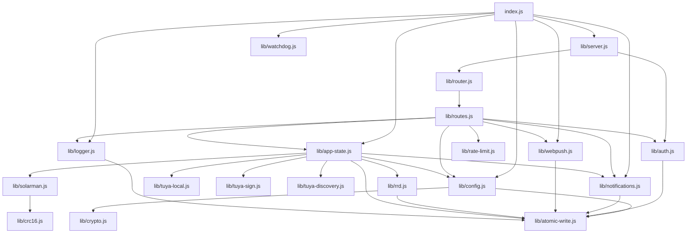

<!-- Parent: /CLAUDE.md -->
<!-- Index:  /DOC_INDEX.md -->
<!-- Related: SYSTEM_OVERVIEW.md, RUNTIME_FLOWS.md, DATA_CONTRACTS.md -->
<!-- Read when: assessing impact of a change, or understanding coupling and external integrations -->

# Dependency Map

**Scope:** Runtime dependency-free status, internal module graph, external integrations, config
surface, and change-impact checklist.
Explicitly does NOT cover: execution traces (`RUNTIME_FLOWS.md`) or concrete schemas
(`DATA_CONTRACTS.md`).

> **Document:** `docs/architecture/DEPENDENCY_MAP.md` (Canonical Architecture)
> **Audience:** Engineers assessing impact of changes, or answering "who calls what".

## Read this when

- You changed a module and want to know what else will be affected.
- You want to understand the coupling between the server, the core loop, and external services.

## Related documentation

- [`docs/architecture/SYSTEM_OVERVIEW.md`](SYSTEM_OVERVIEW.md) — component roles at a glance.
- [`docs/architecture/REPOSITORY_MAP.md`](REPOSITORY_MAP.md) — where files live.
- [`AGENTS.md`](../../AGENTS.md) — protocol-level reference for Tuya local and web push.

---

## 1. Runtime dependencies (npm)

**Zero.** `package.json` declares no `dependencies` for the runtime (`type: module`). All protocols
are implemented on the Node.js standard library (`node:net`, `node:crypto`, `node:http`, `node:fs`,
`node:zlib`, …).

- `node` runtime: **22** (required).
- `data/secret.key` (0600) — filesystem dependency created at boot.
- systemd unit `energy-controller` — supervision + restart.
- Optional CLI tools at runtime: `openssl` (cert generation), `sudo netbird` (NetBird port-forward
  public URL sync).

## 2. Internal module graph

Notes:
- `lib/logger.js` is used broadly for the shared in-memory log ring; it is omitted from many arrows
  above for readability — nearly every module logs through it.
- `lib/atomic-write.js` is the persistence primitive used by config, auth, notifications, webpush,
  rrd, and app-state; never write `data/*.json` directly.
- **Central hub:** `lib/app-state.js` (core loop + device manager + scenes) is depended on by
  `index.js` and by most `routes.js` handlers. It is the file to touch for behaviour changes.
- **User-action boundary:** `routes.js` only talks to subsystems via `app-state` (control, scenes)
  and `auth` (sessions) — there is no direct hardware access from the API layer.

## 3. External integrations

| Integration | Library | Protocol / Port | Direction | Failure mode |
|---|---|---|---|---|
| Solarman V5 inverter | `lib/solarman.js` + `lib/crc16.js` | Modbus TCP over V5 frames, **TCP :8899** | client → inverter | `inverterData.online=false`; retry next poll; scenes relying on inverter data stay off |
| Tuya smart plugs (local) | `lib/tuya-local.js` | Tuya protocol 3.5/6699, **TCP :6668**, **UDP :6667** discovery | client → plugs + device push | closeSock + backoff; `auto` mode falls back to cloud |
| Tuya Cloud API | `lib/tuya-sign.js` | HTTPS `openapi.tuyaeu.com`, HMAC-SHA256 signing | client → cloud | cloud call fails → control error surfaced to UI |
| ntfy | `lib/notifications.js` | HTTPS (ntfy.sh or self-hosted) | client → ntfy | log warning; in-app center still records |
| Telegram Bot API | `lib/notifications.js` | HTTPS `api.telegram.org` | client → Telegram | log warning; in-app center still records |
| Web Push service | `lib/webpush.js` | HTTPS push endpoint (FCM/APNs/Mozilla) + RFC 8291 aes128gcm | client → push service | per-subscription errors; cap 50; silent no-op on non-HTTPS origin |
| NetBird (optional) | `lib/config.js` | `sudo netbird` CLI, `.netbird.services` domain | client → netbird | `cfg.netbird.publicUrl` empty → push `navigate` falls back to stored origin |
| systemd | `lib/watchdog.js` + unit | `WatchdogSec` heartbeat file | unit ↔ process | service restart if heartbeat stalls |

## 4. Configuration surface

`data/config.json` (see `DATA_CONTRACTS.md` § Config for full schema). Top-level sections relevant
to dependencies:

| Section | Drives |
|---|---|
| `inverter` | host/port/SN for `solarman.js` |
| `tuya` | `controlMode`, credentials, device list merge for `tuya-local.js`/`tuya-sign.js` |
| `netbird` | `publicUrl` for push navigate + HTTPS exposure |
| `notifications` | ntfy/Telegram enablement in `notifications.js` |
| `webpush` | VAPID `subject` override in `webpush.js` |
| `auth` | password rules, session TTL in `auth.js` |

## 5. Impact checklist

- **Changing Tuya behaviour** → `lib/tuya-local.js` (+ update `AGENTS.md` protocol section per
  repo rule) and `lib/app-state.js` `controlDevice`; cloud path in `lib/tuya-sign.js`.
- **Changing polling/data** → `lib/solarman.js` (registers), `lib/app-state.js` (interval),
  `lib/rrd.js` (history shape).
- **Adding an API endpoint** → `lib/router.js` (route table) + `lib/routes.js` (handler) + CSRF
  whitelist in `lib/server.js` if it must bypass CSRF.
- **Changing auth** → `lib/auth.js`; CSRF whitelist in `lib/server.js`.
- **Changing persistence** → use `lib/atomic-write.js`; keep `data/` git-ignored.
- **Changing the UI** → `public/index.html` / `public/login.html` / `public/sw.js` only (no build
  step).

---
## Known Gaps / Uncertainties

- `netbirdExec` invokes `sudo netbird`; the required sudoers configuration on the Pi is not
  documented here (see `README.md` / `AGENTS.md` for ops notes).
- `/api/metrics` token behaviour is summarized in `DATA_CONTRACTS.md` §9; the exact scrape format is
  defined in `lib/routes.js` and was not fully enumerated.
- `.github/workflows/` (CI) is out of scope for this dependency map, which covers runtime only.
