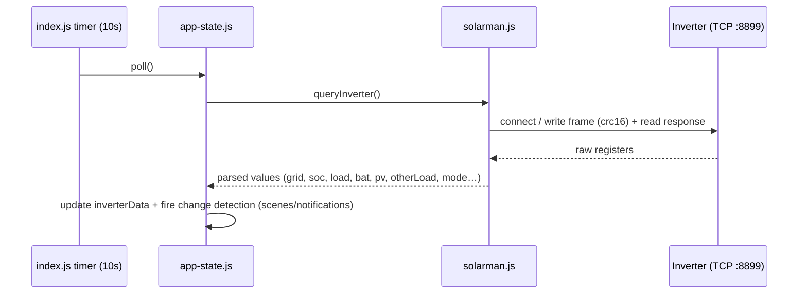
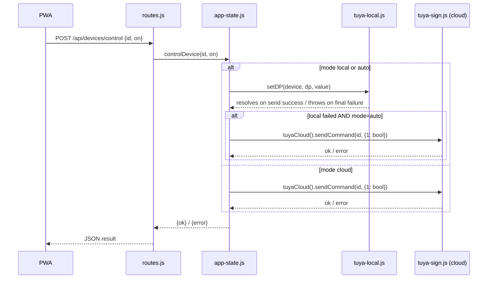
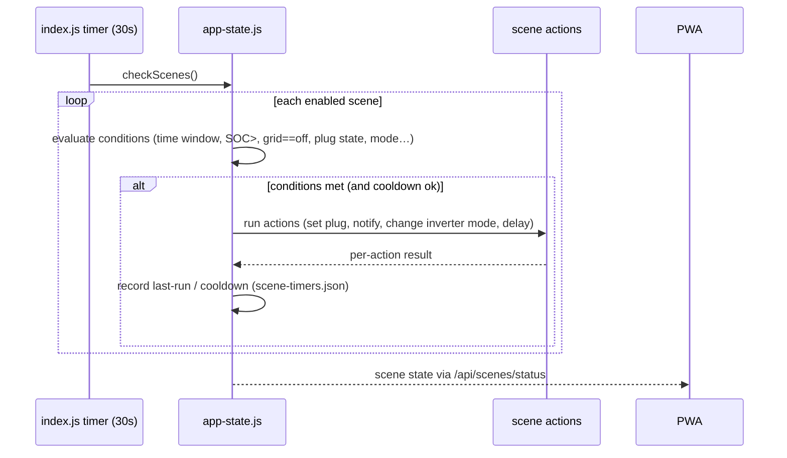

<!-- Parent: /CLAUDE.md -->
<!-- Index:  /DOC_INDEX.md -->
<!-- Related: SYSTEM_OVERVIEW.md, DEPENDENCY_MAP.md, DATA_CONTRACTS.md, AGENTS.md -->
<!-- Read when: tracing how a request or background task actually runs, or debugging lifecycle/connection issues -->

# Runtime Flows

**Scope:** Execution paths, interval cadence, and sequence diagrams for startup, polling, control,
scenes, auth, notifications, watchdog, and shutdown.
Explicitly does NOT cover: component roles (`SYSTEM_OVERVIEW.md`), schema detail
(`DATA_CONTRACTS.md`), or protocol byte-levels (`AGENTS.md`).

> **Document:** `docs/architecture/RUNTIME_FLOWS.md` (Canonical Architecture)
> **Audience:** Engineers debugging behaviour or extending flows.

## Read this when

- You are tracing how a request or a background task actually runs.
- You need to know the cadence of polling, flushing, and scene evaluation.
- You are debugging a lifecycle/restart/connection issue.

## Related documentation

- [`docs/architecture/SYSTEM_OVERVIEW.md`](SYSTEM_OVERVIEW.md) — component roles.
- [`docs/architecture/DATA_CONTRACTS.md`](DATA_CONTRACTS.md) — payload/state shapes.
- [`AGENTS.md`](../../AGENTS.md) — exact Tuya protocol sequence numbers and web push details.

---

## 1. Process startup

1. `index.js` resolves `DATA_DIR`, ensures it exists, loads `config.json` (`lib/config.js`).
2. Ensures `data/secret.key` exists (generates + chmod 0600 if missing).
3. Bootstraps TLS certs (`lib/server.js`): generates self-signed `cert.pem`/`key.pem` if absent.
4. Creates all subsystems: `auth`, `rate-limit`, `rrd`, `notifications`, `webpush`, `app-state`,
   `server`.
5. `app-state.js` kicks off the persistent Tuya local connection and the inverter poll loop.
6. `index.js` registers the interval jobs (see §3) and starts the HTTP(S) server.
7. Optional: syncs NetBird public URL into config (`cfg.netbird.publicUrl`).

> Boot failure handling: if config or secret.key is corrupt, startup logs a clear error and exits
> non-zero so systemd can restart. See `index.js` bootstrap section.

## 2. Persistent Tuya local connection

Driven entirely by `lib/tuya-local.js` (see `AGENTS.md` for the protocol details):

1. `getLocalDevice()` returns the cached device instance; `keeperLoop` keeps one TCP socket alive per
   online device.
2. `ensureConnected()` opens TCP :6668 and performs the 4-step handshake (nonce → HMAC verify →
   HMAC back → derive session key via AES-GCM).
3. While connected: `HEARTBEAT_INTERVAL_MS = 5000` heartbeat keeps the channel through NAT open, and
   device-initiated **push frames** are parsed to update cached DP values (`onPushData`).
4. On query need (`queryAll`): cache hit if < `CACHE_TTL_MS = 30000`; otherwise live DP_QUERY_NEW
   (2 retries); on failure falls back to stale cache.
5. On any socket error: `recordFailure` escalates warn → error (after 10), `closeSock` + backoff
   1 s → 10 s, keeper retries.

## 3. Interval cadence (index.js)

| Interval | Job |
|---|---|
| 10 s | Inverter poll (`app-state.js`) — query Solarman registers → `inverterData` |
| 30 s | Scene check (`app-state.js`) — evaluate all enabled scenes' conditions |
| 60 s | RRD append (`app-state.js` → `rrd.js`) + device status refresh |
| 5 min | RRD flush to disk (`data/history_*.json`) |
| 5 s | Tuya heartbeat per connected device (`tuya-local.js`) |
| 1 h | Session prune (`auth.js`) — drop expired sessions from `sessions.json` |

## 4. Inverter poll flow



- Connection management: lazy reconnect; timeouts; on repeated failure `inverterData.online=false`
  and the frontend shows an offline state.
- **Change detection:** after each successful poll, `app-state.js` compares key values and notifies
  listeners (scene conditions, notifications, web push) only on meaningful deltas.

## 5. Control flow (Tuya device)

`controlMode` is `auto` (local-first + cloud fallback), `local`, or `cloud` (`cfg.tuya.controlMode`):



- Local control uses `setDPs`/`setDP` which write to `pendingUpdates` (fake-it overlay so the UI sees
  the value immediately), debounce 1 s, then a single batched CONTROL_NEW. `await`ing the returned
  flush promise means waiting for the *actual send*. Final failure clears pending + rejects.
- Per-device `maxSimultaneousDps` fallback: if a multi-DP frame fails on all 3 attempts, retry one DP
  at a time and remember it for the device.

## 6. Scene check flow



- Scenes are defined in `data/scenes.json` (see `DATA_CONTRACTS.md` § Scenes).
- Cooldown and last-activity are tracked to avoid action storms.

## 7. Login / auth flow

```mermaid
sequenceDiagram
    participant UI as login.html
    participant R as routes.js
    participant A as auth.js
    participant RL as rate-limit.js

    UI->>R: POST /login {username, password}
    R->>RL: check IP/user rate limit
    R->>A: verify (scrypt + timingSafeEqual)
    alt ok
        A->>A: create session {exp, csrf} → sessions.json
        R-->>UI: Set-Cookie sid=… + {success, mustChangePassword?}
    else bad password
        RL: consume bucket
        R-->>UI: 401 {success:false}
    end
```

- All `/api` mutations require a valid session cookie **and** matching CSRF token (header/body)
  except the whitelisted endpoints: `POST /api/push/subscribe`, `POST /api/push/unsubscribe`,
  `GET /api/metrics`, `POST /api/watchdog-alert`.
- Forced password change: first boot creates `admin` with a default password; `auth.json`
  `mustChangePassword:true` forces the change-password sheet after login.

## 8. Notification & web push flow

1. `createNotifications(DATA_DIR, loadConfig, onNotify)` subscribes to every `pushNotification` event.
2. Each notification is appended to the in-app center (`data/notifications.json`) and sent to
   ntfy/Telegram depending on `cfg` notification settings.
3. `onNotify` → `webpush.broadcast({title, message, type, unread})` — fire-and-forget, debounced 2 s.
4. `broadcast` encrypts the **declarative Web Push JSON** (RFC 8291 aes128gcm) with the `app_badge`
   on top-level (WebKit reads it only from top-level) and sends to every subscription.
5. Service worker (`public/sw.js`): app open → `postMessage` → `pollNotifs`; app closed → parse
   `event.data` declarative JSON → `setAppBadge` + notification (non-info types); no data → fetch
   unread.
6. Push registration only happens from a valid public HTTPS origin (NetBird `.netbird.services` URL);
   on a self-signed LAN IP it is a silent no-op.

## 9. Watchdog flow

- `lib/watchdog.js` appends a heartbeat line to `data/watchdog.log` on the configured interval.
- systemd unit uses `WatchdogSec` to restart the service if the heartbeat stalls.

## 10. Shutdown

- SIGTERM/SIGINT → `index.js` stops timers, flushes RRD to disk, closes Tuya sockets and the HTTP
  server, then exits cleanly.
- `tuya-local.js` `destroy()` rejects any in-flight flush promise so awaiting callers don't hang.

---
## Known Gaps / Uncertainties

- The `gridPower` derivation and the inverter register semantics (see `SYSTEM_OVERVIEW.md` Known
  Gaps) also affect the poll flow: scenes and change-detection rely on derived values.
- Demo data injection (`_isDemo`) when the inverter is unreachable is visible in `app-state.js`
  (`injectDemoData`); the exact trigger conditions were not confirmed with the owner.
- Scene cooldown parameters (beyond `scene-timers.json` structure) are not fully specified; exact
  anti-storm logic lives in `lib/app-state.js` scene section.
