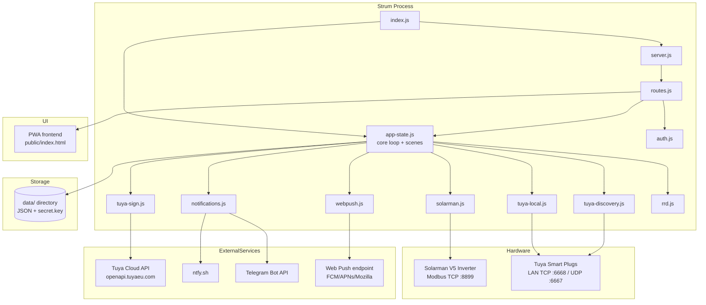
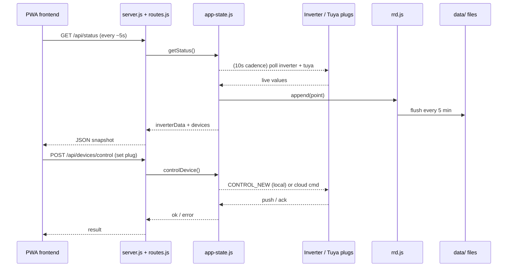

<!-- Parent: /CLAUDE.md -->
<!-- Index:  /DOC_INDEX.md -->
<!-- Related: RUNTIME_FLOWS.md, REPOSITORY_MAP.md, DEPENDENCY_MAP.md, DATA_CONTRACTS.md, AGENTS.md -->
<!-- Read when: onboarding to the system, or reasoning about system-level behaviour -->

# System Overview

**Scope:** Component map, goals, module responsibilities, high-level data flow, and security model.
Explicitly does NOT cover: step-by-step execution traces (`RUNTIME_FLOWS.md`), file layout
(`REPOSITORY_MAP.md`), dependency/coupling detail (`DEPENDENCY_MAP.md`), or concrete schemas
(`DATA_CONTRACTS.md`).

> **Project:** Strum — autonomous energy controller for Raspberry Pi
> **Document:** `docs/architecture/SYSTEM_OVERVIEW.md` (Canonical Architecture)
> **Audience:** New engineers onboarding to the codebase; anyone reasoning about system-level behaviour.

## Read this when

- You need a mental model of the whole system before touching any subsystem.
- You are about to work on the inverter integration, Tuya device control, scene engine, or auth.
- You want to know how the data flows from physical hardware to the PWA frontend.

## Related documentation

- [`docs/architecture/RUNTIME_FLOWS.md`](RUNTIME_FLOWS.md) — step-by-step flows (startup, polling, control, scenes, auth).
- [`docs/architecture/DATA_CONTRACTS.md`](DATA_CONTRACTS.md) — schemas of persistent data and API payloads.
- [`docs/architecture/DEPENDENCY_MAP.md`](DEPENDENCY_MAP.md) — internal module graph and external integrations.
- [`docs/architecture/REPOSITORY_MAP.md`](REPOSITORY_MAP.md) — file-by-file layout.
- [`AGENTS.md`](../../AGENTS.md) — engineering conventions, Tuya local protocol details, web push details.

---

## 1. Overview

Strum is a **standalone, dependency-free** (no npm packages) Node.js 22 application that runs on a
Raspberry Pi and manages a home energy setup built around a hybrid solar inverter:

- **Reads** live data from a **Solarman V5 inverter** over Modbus TCP (`lib/solarman.js`, `lib/crc16.js`).
- **Controls** smart plugs (**Tuya** protocol 3.5/6699 locally over AES-128-GCM, or via the Tuya
  Cloud API) (`lib/tuya-local.js`, `lib/tuya-sign.js`, `lib/tuya-discovery.js`).
- **Automates** everything through a scene engine (conditions → actions) (`lib/app-state.js`).
- **Serves** a PWA frontend (dark-mode SPA, charts, control panels) over HTTP/HTTPS (`public/`).
- **Notifies** the owner via ntfy, Telegram, and encrypted Web Push (VAPID + RFC 8291 aes128gcm) —
  all implemented from scratch with zero dependencies (`lib/notifications.js`, `lib/webpush.js`).

Everything runs in a **single Node.js process** launched by systemd (`energy-controller`).
Persistent state lives in `data/`. The whole system is a tree: `index.js` wires up `lib/` modules,
`lib/server.js` handles HTTP, `lib/routes.js` defines the API, and `lib/app-state.js` is the core
state machine + automation engine.

## 2. Goals

1. **Autonomy** — keep the household powered through outages by automatically switching the inverter
   into survival/island mode and controlling loads (smart plugs) per configured scenes.
2. **Zero-dependency operation** — everything (Modbus, Tuya crypto, Web Push crypto, HTTP, TLS cert
   generation) is implemented with the Node.js standard library only, so deployment is `scp` + restart.
3. **Resilience** — retries, backoff, fallbacks (local→cloud), stale-cache tolerance, and a watchdog
   heartbeat so the service survives flaky LAN hardware and survives without internet.
4. **Local-first privacy** — all credentials are stored encrypted on-device; external cloud (Tuya,
   push services) is used only for reachability where the hardware demands it.

## 3. System Components

## 4. Core Concepts

| Concept | Where | Description |
|---|---|---|
| **Inverter poll** | `app-state.js` | Every 10 s the inverter is queried over Modbus TCP; results cached in `inverterData`. |
| **RRD history** | `rrd.js` | Ring-buffer series at 1 m / 15 m / 1 h granularity persisted to `data/history_*.json`. |
| **Island / survival mode** | `app-state.js` | When grid is down the inverter mode changes (survival), overhead learns the base load. |
| **Scene** | `app-state.js` | A named automation: `if` conditions (time, SOC, grid, plug state) → `then` actions (set plug, notify, switch inverter mode). Checked every 30 s. |
| **Tuya control mode** | `app-state.js`, `tuya-local.js` | `auto` (local-first, cloud fallback), `local`, or `cloud` per device (`cfg.tuya.controlMode`). |
| **Session** | `auth.js` | Cookie + CSRF-token authenticated sessions persisted in `data/sessions.json`. |
| **Secret store** | `crypto.js` | AES-256-GCM encryption of sensitive config fields using a master key in `data/secret.key` (mode 0600). |
| **Notifications** | `notifications.js` | In-app center + ntfy + Telegram; each push type fires `webpush.broadcast`. |

## 5. Module Responsibilities (top level)

| Module | Responsibility | Key exports |
|---|---|---|
| `index.js` | Process entry: config load, data-dir setup, wiring, polling/save intervals, graceful shutdown. | `main()` |
| `lib/server.js` | TLS cert bootstrap, HTTP server, auth middleware, CSRF, static + API serving, security headers. | `startServer()` |
| `lib/router.js` | Route table, body parsing (1 MB cap), cookies, JSON/HTML/text response helpers. | `registerRoutes()`, `parseBody()` |
| `lib/routes.js` | All `/api/*` handlers (status, devices, scenes, notifications, config, auth, webpush, watchdog). | `setupRoutes()` |
| `lib/app-state.js` | Core state: inverter polling, cost tracking, Tuya device manager, scene engine, device status. | `createAppState()` |
| `lib/solarman.js` | Solarman V5 Modbus TCP client: connect, send/receive frames, parse registers. | `createSolarmanClient()` |
| `lib/tuya-local.js` | Tuya local protocol 3.5/6699: handshake, CONTROL_NEW, DP query, push, persistent connection. | `createTuyaLocal()` |
| `lib/tuya-sign.js` | Tuya Cloud HMAC-SHA256 signing + HTTP calls (get status, send commands). | `tuyaCloud()`, `signRequest()` |
| `lib/tuya-discovery.js` | UDP broadcast discovery on port 6667 (used by diagnostics scripts). | `discover()` |
| `lib/rrd.js` | Ring-buffer time series append + downsampling for 1 m / 15 m / 1 h. | `createRRD()` |
| `lib/notifications.js` | ntfy + Telegram senders and the in-app notification center. | `createNotifications()` |
| `lib/webpush.js` | VAPID keygen, RFC 8291 aes128gcm encryption, declarative broadcast, subscription store. | `createWebPush()` |
| `lib/auth.js` | Password hashing (scrypt), session tokens, CSRF, metrics token, login handling. | `createAuth()` |
| `lib/config.js` | Config load/save, secret encryption via `crypto.js`, netbird CLI sync. | `loadConfig()`, `saveConfig()` |
| `lib/crypto.js` | AES-256-GCM master-key encryption/decryption (`data/secret.key`). | `encryptSecret()`, `decryptSecret()` |
| `lib/rate-limit.js` | Token-bucket rate limiting keyed by IP and user. | `rateLimit()`, `createRateLimiter()` |
| `lib/logger.js` | In-memory ring of recent log lines (exposed via `/api/logs`). | `logger` |
| `lib/watchdog.js` | Periodic heartbeat file write for systemd `WatchdogSec`. | `startWatchdog()` |
| `lib/atomic-write.js` | Atomic JSON/file writes (temp + rename). | `atomicWriteJson()` |
| `lib/crc16.js` | Modbus CRC-16 used by Solarman frames. | `crc16Modbus()` |

## 6. Data Flow (high level)

## 7. Security Model (summary)

Full details in `docs/architecture/DATA_CONTRACTS.md` § "Security" and the audit in Step 3.

- **TLS** — self-signed cert auto-generated at first boot (`data/cert.pem`, `data/key.pem`); optional
  NetBird port-forward for public HTTPS access (`cfg.netbird.publicUrl`).
- **Auth** — scrypt (64-byte hash, `timingSafeEqual`) password check; session cookie `sid` +
  per-session CSRF token; CSRF enforced on `POST`/`PATCH`/`DELETE` under `/api` (with explicit
  whitelist: `push/subscribe`, `push/unsubscribe`, `metrics`, `watchdog-alert`).
- **Secrets** — Tuya credentials and other sensitive config encrypted at rest (AES-256-GCM,
  `data/secret.key`, mode 0600).
- **Rate limiting** — token bucket per IP + per user; `X-Forwarded-For` trusted only from loopback.
- **Web Push** — VAPID (ECDSA P-256), RFC 8291 aes128gcm encrypted payloads, subscription cap 50.

## 8. Assumptions & Non-Goals

- **Single user, single Pi, single inverter.** No multi-tenant, no clustering, no load balancing.
- **Tuya protocol 3.5 only** for local control (deliberately not 3.3/3.4 — devices are 3.5).
- **No npm ecosystem** — never add a package unless the owner explicitly approves.
- The PWA is served by the same Node process (no separate build step, no framework).
- History retention is bounded by ring-buffer sizes (1 m = 1440 pts ≈ 24 h, 15 m = 672 pts ≈ 7 d,
  1 h = 8760 pts ≈ 365 d — see `rrd.js`).

---
## Known Gaps / Uncertainties

- `gridPower` is **derived** from a grid-status register (raw word `0x0040`), not read directly;
  the exact derivation rule is inferred from `lib/app-state.js` and should be confirmed against the
  physical inverter before relying on it.
- Inverter register addresses (`0x00B8` SOC, `0x00BA` PV, etc.) are taken from `lib/solarman.js`;
  they are consistent with the vendor frame format but vendor documentation was not available for
  cross-checking — see `DATA_CONTRACTS.md` §4.
- Poll/save cadences (10 s / 30 s / 60 s / 5 min) are the hard-coded values in `index.js` +
  `lib/app-state.js`; any configuration override of these is not documented.
- Tuya `controlMode` (`auto`/`local`/`cloud`) is a deliberate extension beyond the HAOS reference
  integration — see `AGENTS.md` (Tuya Local section) for the rationale.
